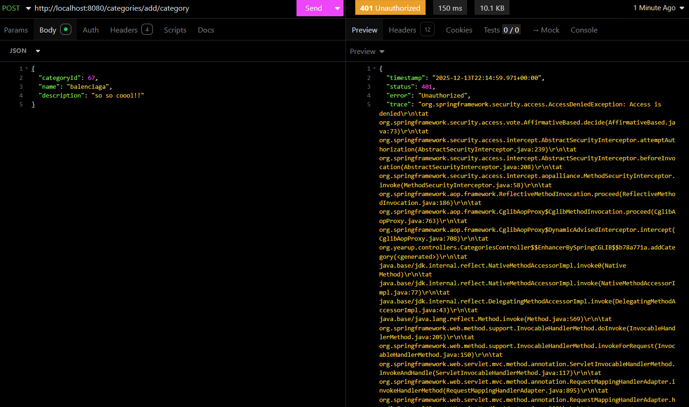

# eCommerce Store – Clothing Store

## 📌 Project Overview

The **eCommerce Store – Clothing Store** is a backend application built with **Spring Boot** that provides RESTful APIs for managing a clothing-based eCommerce platform. The project focuses on authentication, authorization, and core store functionality, including **user login** and **admin login** using direct APIs.


---

## 🛠️ Tech Stack

* **Java**
* **Spring Boot**
* **Spring Web (REST APIs)**
* **Database**: MySQL

---
## 💻 Interesting Piece of code
```java
    @Override
    public void purchaseCart(int userId) {
        String profile = "SELECT address, city, state, zip FROM profiles WHERE user_id = ?";
        String deleteItems = "DELETE FROM shopping_cart WHERE user_id = ?";
        String insertOrder = "INSERT INTO orders(order_id, user_id, date, address, city, state, zip, shipping_amount) VALUES (?,?,?,?,?,?,?,?);";
        int orderId = (int) Math.round(Math.random() * 10000);
        LocalDateTime localDateTime = LocalDateTime.now();
        String date = localDateTime.toString();

        try(Connection connection = getConnection())
        {
            try(PreparedStatement checkStmt = connection.prepareStatement(profile)) { // if item exists
                checkStmt.setInt(1, userId);

                ResultSet rs = checkStmt.executeQuery();
                String address = rs.getString("address");
                String city = rs.getString("city");
                String state = rs.getString("state");
                int zip = rs.getInt("zip");
                try (PreparedStatement insertStmt = connection.prepareStatement(insertOrder, PreparedStatement.RETURN_GENERATED_KEYS)) { // insert order
                    insertStmt.setInt(1, orderId);
                    insertStmt.setInt(2, userId);
                    insertStmt.setString(3, date);
                    insertStmt.setString(4, address);
                    insertStmt.setString(5, city);
                    insertStmt.setString(6, state);
                    insertStmt.setInt(7, zip);
                    insertStmt.setInt(8, 15);
                    insertStmt.executeUpdate();

                }

                try (PreparedStatement statement = connection.prepareStatement(deleteItems))
                {
                    statement.setInt(1, userId);
                    statement.executeUpdate();
                }
                catch (SQLException e)
                {
                    throw new RuntimeException(e);
                }
            }
        }
        catch (SQLException e)
        {
            throw new RuntimeException(e);
        }
    }
```
---

## ✨ Features

* User authentication (Login API)
* Admin authentication (Admin Login API)
* Role-based access (User vs Admin)
* RESTful API architecture
* Secure password handling
* Scalable backend structure

---

## 🔐 Authentication APIs

### User Login

```http
POST /login
```

**Request Body:**

```json
{
  "email": "user@example.com",
  "password": "password123"
}
```

---

### Admin Login

```http
POST /login
```

**Request Body:**

```json
{
  "email": "admin@example.com",
  "password": "adminPassword"
}
```

---

## 🚀 Getting Started

### Prerequisites

* Java 17+ (or compatible version)
* Maven
* Database (MySQL, PostgreSQL, or H2)

### Installation

1. Clone the repository:

```bash
git clone https://github.com/0x2x/ClothingStore
```

2. Navigate to the project directory:

```bash
cd ecommerce-store
```

3. Configure the database in `application.properties` or `application.yml`.

4. Build and run the application:

```bash
mvn clean install
mvn spring-boot:run
```

The server will start at:

```text
http://localhost:8080
```

---

## 🧪 Testing APIs

You can test the APIs using:

* Insomnia
* Curl

---

## 📂 Project Structure

```
src/main/java
 ├── configurations
 ├── controllers
 ├── data
 ├── models
 └── security
```

---

## 🔮 Future Enhancements

* Product management (CRUD)
* Shopping cart functionality
* Order management
* Payment gateway integration
* JWT-based authentication
* Swagger API documentation

---

## 👤 Author

**Nigel**
Backend Developer | Spring Boot

---

## Using authenitcated requests
Using authenitcated requests while not being an admin returns an error:

